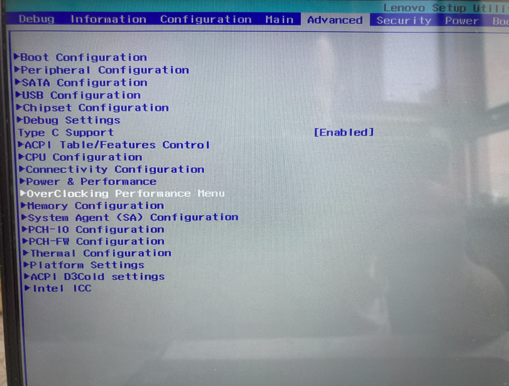
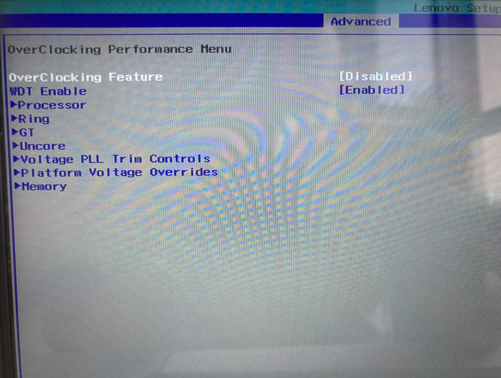

中文  
[ENGLISH](./readme-en.md)

## 说明：
* 本实验所涉及动作或行为可能导致电脑无法开机甚至损坏主板,请在了解风险后进行实验
* 一定不要超频内存！！！
	
## 目的：
* 解锁OverClocking Performance Menu菜单及项目

## 工具：
* FPT H2OEZE SetupUtility_UnlockOCPM.ffs
 
## 引用：
* 原文来自[百度贴吧](https://tieba.baidu.com/p/6118801225) 

## 步骤：
1.手工关闭BIOSLOCK和关闭FLASH写保护,目的使能FPT工具刷BIOS
	
>	[隐藏BIOS](https://user-images.githubusercontent.com/50404193/104993733-3b1b4280-5a5e-11eb-8916-a977c8b0d54c.jpg)的Advanced下  
>	菜单PCH-IO Configuration--项目Flash Protection Range Registers,设置值DISABLE  
>	菜单PCH-IO Configuration--菜单Security Configuration--项目Bios Lock项, 设置值DISABLE  
	
2.使用FPT工具导出当前BIOS  
> 管理员身份运行FPT14工具下的backup.bat  
> 命令行窗口跑完会在在当前目录下生成backup.fd文件
	
3.使用H2OEZE工具替换setupUtility模块
> 管理员运行H2OEZE工具,在File菜单选择Load导出的backup.fd文件  
> 窗口左侧Components--Module--Replace module功能  
> 窗口右侧Select module to replace,滚到最后面找到XXXXXXXXXXXXXXXXXX(FVxx)(SetupUtility)的模块  
> 窗口右侧Load module form..选择工具包附带的SetupUtility_UnlockOCPM.ffs后Apply  
> 在File菜单下save as..路径选择FPT14目录,名称change,类型fd,后保存
	
4.使用FPT工具刷回修改后的BIOS（危险!!!）  
> 管理员运行FPT14工具下的change.bat  
> 弹出命令行窗口跑完会自动退出,重启BIOS就OK了  
> 如果报错了,把前面备份的backup.fd文件改成change.fd,执行change.bat恢复bios吧,放弃吧  
	
## 后记：
* 买了根3200MHz 16G条子,换上去后发现工作在2667,首先想到的是两根条子就低原则随了板载4G条子的频率，进BIOS @#¥%⋯⋯&一顿操作没找到调整项，刷BIOS @#¥%⋯⋯&*一顿操作没效果  
于是,我又翻了一下主板参数, CPU内存控制支持最高2666,WTF!!!  
