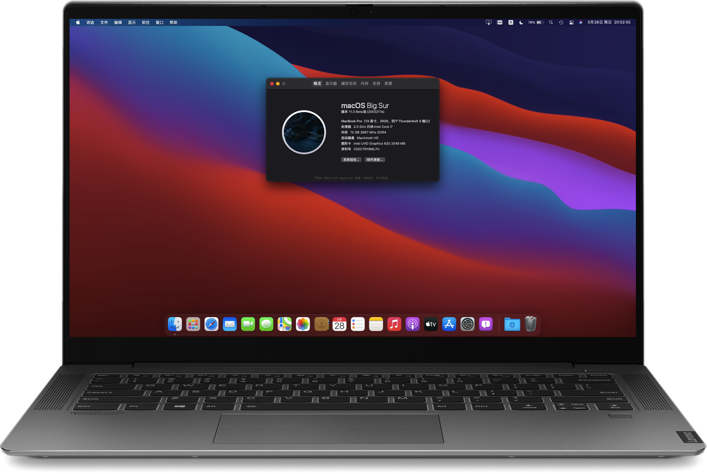

# Lenovo XiaoXin Air-14 2019IML

Screenshot app: https://github.com/lihaoyun6/capXDR-plugins/  
The installer is in: app/capXDR.dmg  
Model：Lenovo-Air14IML (made by lietxia)  
QQ group number：1032311345

[中文](./README.md)  
ENGLISH  

|      Info       |                              Details                              |
| :-------------: | :---------------------------------------------------------------: |
| Computer model💻 |                   Lenovo XiaoXin Air14 IML 2019                   |
|       CPU       |               intel Core i5-10210U @ 1.60GHz 4core                |
|   Motherboard   |                        lenovo LNVNB161216                         |
|      GPU👾       |                   Nvidia GeForce MX250 ( 2 GB )                   |
|     Memory      |   internal 4GB 2666+changeable mem ( I changed into 16GB 2666)    |
|     Disks🖴      |           512GB 2242 SATA SSD + HIKVISION c2000Pro 1TB            |
|     Screen🖥️     |                      AUO353D ( 14-inches  )                       |
|   Audio Card🔊   |                          Conexant CX8070                          |
|    Wireless🌐    | intel Wireless-AC 9560( able to use, but I changed into DW 1820A) |
| SD card reader🗂️ |           O2 Micro SD card reader( probably different)            |

## Current Status：
* System🌌：Works fine on both 10.15.7 and Big Sur 11.2 (20D53) (recommend macOS 10.15.7. It is system lower 10.15 that the trackpad won‘t work. System lower 10.15.4 may lag while startup)
* Disks🖴：If you are using Samsung PM981A, please consider to change. Or install by this way: http://bbs.pcbeta.com/forum.php?mod=viewthread&tid=1867021
* Discrete graphics👾：Blocked (Can't work anyway)
* Internal graphics👾：Success
* Trackpad🖐️：Success (support gesture, 5 fingers at most)
* Audio Card🔊：Success with layout-id 15, no plosive [Headsets_with_Microphone](https://github.com/lietxia/XiaoXinAir14IML_2019_hackintosh/releases/tag/0.0.1)
* Wi-Fi🌐：DW1820A works fine with most of functions, AC 9560 can use some of AWDL functions.
* Bluetooth：DW1820A works，AC 9560 works unsteadily.
* HDMI：Success(4K@30FPS at most, same as Windows)
* Canera🎦：Success (it's pretty easy to drive USB camera)
* SD card reader🗂️：Works (Lenovo got a PCI channel reader. There is a small probability that the reader is different)
* Sleep😴：Support native sleep.

## Related model
* [XiaoXin Pro13 (i5-10210U / i7-10710U)](https://github.com/daliansky/XiaoXinPro-13-hackintosh)
* [XiaoXin13 IML](https://github.com/sun19970908/XiaoXin13IML_2020_hackintosh)
* [XiaoXin Air13 IWL (i5-8265U / i7-8565U)](https://github.com/daliansky/Lenovo-Air13-IWL-Hackintosh)
* [XiaoXin Air15 IKBR (i5-8265U)](https://github.com/czy1024/XiaoXin-Air15-IKBR-2018-EFI)
* [XiaoXin Air14 (i5-1035G1)](http://bbs.pcbeta.com/viewthread-1873103-1-1.html)
* [XiaoXin Air14 (i7-1065G7)](http://bbs.pcbeta.com/viewthread-1878378-1-1.html)
* [XiaoXin Air15 (i5-1035G1)](http://bbs.pcbeta.com/viewthread-1874022-1-1.html)
* [XiaoXin Air15 (i5-10210U)](http://bbs.pcbeta.com/viewthread-1859586-1-1.html)
* [Lenovo-Ideapad-S540-15IML (i5-10210U)](https://github.com/3ig/IdeaPad-S540-15IML-hackintosh)
* [Lenovo-Ideapad-S540-15IML (i5-10210U)](https://github.com/ayush5harma/IdeaPad-S540-Hackintosh)
* [Lenovo-Ideapad-S540-15IWL (i5-8265U)](https://github.com/IvanAleksandrov94/Lenovo-s340-s540-Big-Sur-OpenCore-i5-8265u)
* [Lenovo-Ideapad-S540-14IML (i5-10210U)](https://github.com/marianopela/Lenovo-Ideapad-S540-14IML-Hackintosh)
* [Lenovo-Ideapad-S540-14IWL (i5-8265U)](https://github.com/Hasodikis/Lenovo-Ideapad-s540-14IWL---Hackintosh)

## BIOS 
https://newsupport.lenovo.com.cn/driveDownloads_detail.html?driveId=78312
<details>
<summary>Details</summary>
2021/01/18 BIOS Version: CKCN16WW http://newdriverdl.lenovo.com.cn/newlenovo/alldriversupload/78312/BIOS-CKCN16WW.exe <br />
2020/07/24 BIOS Version: CKCN15WW http://newdriverdl.lenovo.com.cn/newlenovo/alldriversupload/73409/BIOS-CKCN15WW.exe <br /> 
2020/06/22 BIOS Version: CKCN14WW http://newdriverdl.lenovo.com.cn/newlenovo/alldriversupload/72386/BIOS-CKCN14WW.exe <br />  
2019/12/16 BIOS Version: CKCN12WW http://newdriverdl.lenovo.com.cn/newlenovo/alldriversupload/67169/BIOS-CKCN12WW.exe <br />  
2019/08/08 BIOS Version: CKCN11WW http://newdriverdl.lenovo.com.cn/newlenovo/alldriversupload/60449/BIOS-CKCN11WW.exe <br />  
</details>

## Microcode
https://newsupport.lenovo.com.cn/driveDownloads_detail.html?driveId=77695
<details>
<summary>Details</summary>
2020/12/17 Version: CKME03WW http://newdriverdl.lenovo.com.cn/newlenovo/alldriversupload/77695/FW-CKME03WW.exe <br /> 
2020/06/23 Version: CKME02WW http://newdriverdl.lenovo.com.cn/newlenovo/alldriversupload/72429/ME-CKME02WW.exe <br />
2019/12/16 Version: CKME01WW http://newdriverdl.lenovo.com.cn/newlenovo/alldriversupload/67174/FW-CKME01WW.exe <br /> 
</details>

## Abnormal：
* `Fingerprint sensor` is unable to work.
* Nvida MX250
* ~~Earphone integrated with microphone 🎧 , microphone doesn't work.🎤~~ 2021-02-05:[Works now](https://github.com/lietxia/XiaoXinAir14IML_2019_hackintosh/releases/tag/0.0.1)
* ~~Can't mute, but you can switch it to the minimum.~~(Solved)
* ~~Lag during boot.~~(Sloved in 10.15.4)  
* ~~The touchpad uses polling mode, which can recognize 5 fingers at most. However, polling is not perfect, and there will be a small instant loss of status.~~ (New touch pad driver greatly improved)

### YogaSMC： `Experimental`
* Normal: Fan three modes switch, microphone mute, flight mode, F10 switch screen, touchpad switch hint, keyboard backlight, Fn function key switch.
* Abnormal: the camera has a hint, but it can't be turned off, the lock function can't be used, FN + Q can't work, the keyboard backlight will be displayed incorrectly when the power is plugged in, the control panel can't be entered randomly, and the battery temperature can't be read out.

## Trackpad
Use this way if rebuilding the cache touchpad still does not work:
https://github.com/lietxia/XiaoXinAir14IML_2019_hackintosh/releases/tag/2020.04.05

## TIPS  
> XiaoXin AIR14-2019 i5-10210u QQ group number: 1032311345  
> If you are using OpenCore, Please use BIOS except for 1.0.2  (1.0.2 you need to turn off the Hyper-Threading to use OC.)

### Synchronize bluetooth link keys from macOS to windows
https://github.com/lietxia/BT-LinkkeySync

### Big Sur hidpi

    bash -c "$(curl -fsSL https://raw.githubusercontent.com/xzhih/one-key-hidpi/dev/hidpi.sh)"

### Catalina hidpi

    bash -c "$(curl -fsSL https://raw.githubusercontent.com/xzhih/one-key-hidpi/master/hidpi.sh)"
    
### DW1820A Windows 10 driver
https://www.dell.com/support/home/zh-cn/drivers/driversdetails?driverid=98wfd

### Changelog
* 2021-02-10 12:00
    * Fix OC KP while using `YogaSMC`.
    * Add Theme and startup audio.
 
* 2021-02-10 01:03
    * Add `SSDT-NDGP_OFF-Air14IML.aml` to block the Nvdia graphics card
    * Touchpad `SSDT-TPAD-Air14IML.aml` changed to GPIO mode, pin=`50`
    * Fixed `SSDT-BATX-Air14IML.aml` to show battery remaining available time
    * Update `voodooi2c` to version 2.6.4
    * Remove `SSDT-XSPI.aml`, `SSDT-UIAC.aml`, `SMCSuperIO.kext`, `NoTouchID.kext` which are no longer needed
    * Fix the problem that Clover can't boot BigSur (need to choose Preboot to boot bigSur)
    * Minor changes to `install.command` and `uninstall.command` scripts of `ALCPlugFix`.

* 2021-02-05 08:20
    * Reduce itlwm size, no changes for DW1820A.

* See [changelog-en.md](changelog-en.md) for the history of changes

## Installation
1. If you are using OpenCore, Please use BIOS except for 1.0.2  (1.0.2 you need to turn off the Hyper-Threading to use OC.)
2. Change BIOS settings
    * https://github.com/lietxia/XiaoXinAir14IML_2019_hackintosh/wiki/bios
3. Completely follow the method of Lenovo Xiaoxin Pro 13 to install.
    * https://blog.daliansky.net/Lenovo-Xiaoxin-PRO-13-2019-and-macOS-Catalina-Installation-Tutorial.html
    * https://www.bilibili.com/video/BV1A54y1X78F
4. Change DVMT and CFG Lock.
5. Change your EFI. (You can change before installation.)

## Advice
* Because current hibernate cannot wake up normally, in order to avoid affecting sleep, use  the terminal to turn off hibernate `sudo pmset -a hibernatemode 0`

### Change DVMT and CFG Lock
* You must unlock `CFG Lock` , otherwise, you can't use both OpenCore and Clover。 
* We recommend to change `DVMT` into 64M, there's no damage to your computer. 

#### Recommend: get into hidden BIOS  
You need to disable`onekeybattery`in the BIOS to enter hidden bios.  

- The way to enter hidden BIOS
  - Press following buttons with your computer closed.
    - `F4` → `4` → `R` → `F` → `V`
    - `F5` → `5` → `T` → `G` → `B`
    - `F6` → `6` → `Y` → `H` → `N`
  - Power on → Press F2, speed up if failed.
- Change the following settings.
  - `Advanced` → `Power & Performance` → `CPU - Power Management Control` → `CPU Lock Configuration` → `CFG Lock` → `Disabled`
  - `Advanced` → `System Agent (SA) Configuration` → `Graphics Configuration` → `DVMT Pre-Allocated` → `64M`

#### Backup solution: change in Windows
Refer to https://github.com/lietxia/XiaoXinAir14IML_2019_hackintosh/wiki/DVMT  
`DVMT`：  
* Area : `SaSetup`
* Offset : `0x107`
* `01` to `02`

`CFG LOCK`：  
* Area : `CpuSetup`
* Offset : `0x3E`
* `01` to `00`

## TIPS
### 1. Trackpad not working.
Upgrading the system cause trackpad failures.
The cache needs to be rebuilt to make the trackpad work normally. 
Restart after running following commands.

```
sudo mount -uw /
killall Finder
sudo kextcache -i /
```

### 2. The audio card isn't working.
AppleALC 1.5.1 and later doesn't have this issue anymore.  
~~Switching from win to mac will cause the audio card fail to syart. At this time, you need to turn it off and turn it on again, and the audio card will recover~~  
~~Consultation got the answer: win restart is warm boot, will skip hardware detection, directly restart into mac will have problems~~

* ~~Suggestion: switch from win to mac, do not restart, shut down first, and then turn on~~
* ~~Restart from mac won't cause this.~~

### 3. The screen went black after entering the system (01.06 EFI)
A bug of WhatEverGreen.kext
It is by resetting nvram or downgrade WhatEverGreen.kext that won't face this issue.

## How to make it better?
* PrintScreen can't be used under mac. I map it to F13 and you can change the shortcut key of screenshot to F13
* Turn on HiDPI (see HiDPI part)

### SSDTs
| SSDTs                   | Info                                   | Necessary | Recommended | Optional |
| ----------------------- | -------------------------------------- | --------- | ----------- | -------- |
| ~~SSDT-OCPublic-Merge~~ | EC+RTC0+USBX+ALS0+MCHC                 |           |             | √        |
| SSDT-SBUS-MCHC          | Fake BUS0, DVL0, MCHC device           |           | √           |          |
| SSDT-EC-USBX            | Fake EC device, USB Power Patch        | √         |             |          |
| SSDT-TPAD-Air14IML      | I2C Trachpad patch (AIR14IML only)     | √         |             |          |
| SSDT-DMAC               | Fake DMA controller                    |           |             | √        |
| SSDT-GPRW               | Anti immediate wakeup: 0D/6D           | √         |             |          |
| SSDT-PMC                | Fake PMC device                        |           | √           |          |
| SSDT-HPTE               | Disable HPET patch                     |           |             | √        |
| SSDT-PNLFCFL            | Coffee Lake PNLF patch                 | √         |             |          |
| SSDT-PR00               | X86 CPU Power Management (Enable XCPM) | √         |             |          |
| SSDT-RMCF-Air14IML      | PS2 key mapping patch                  | √         |             |          |
| ~~SSDT-UIAC~~           | Custom USB(No longer need)             |           | √           |          |
| ~~SSDT-XSPI~~           | Fake XSPI device(No longer need)       |           |             | √        |
| SSDT-BATX-Air14IML      | Battery extra info                     |           |             | √        |
| SSDT-AWAC               | “Fake” RTC timer                       |           | √           |          |
| SSDT-ECRW               | YogaSMC EC accessibility               |           |             | √        |
| ~~SSDT-RCSM~~           | YogaSMC Clamshell Mode patch           |           |             | √        |

### Kexts
| Kexts                       | Info                  | Necessary | Optional |
| --------------------------- | --------------------- | --------- | -------- |
| AirportBrcmFixup.kext       | DW1820A Wi-Fi         |           | √        |
| AppleALC.kext               | HDMI & Audio          | √         |          |
| BrcmBluetoothInjector.kext  | DW1820A bluetooth     |           | √        |
| BrcmFirmwareData.kext       | DW1820A bluetooth     |           | √        |
| BrcmPatchRAM3.kext          | DW1820A bluetooth     |           | √        |
| Lilu.kext                   | Kernel extension      | √         |          |
| ~~NoTouchID.kext~~          | No TouchID            |           | √        |
| SMCBatteryManager.kext      | SMC battery           | √         |          |
| SMCProcessor.kext           | SMC-processor         | √         |          |
| ~~SMCSuperIO.kext~~         | CPU fan               |           | √        |
| VirtualSMC.kext             | SMC(important)        | √         |          |
| VoodooI2C.kext              | Trackpad core         | √         |          |
| VoodooI2CHID.kext           | HID trackpad          | √         |          |
| VoodooPS2Controller.kext    | Keyboard driver       | √         |          |
| WhateverGreen.kext          | IGPU driver           | √         |          |
| IntelBluetoothFirmware.kext | AC9560 Bluetooth      |           | √        |
| IntelBluetoothInjector.kext | AC9560 Bluetooth      |           | √        |
| AirportItlwm-Sur.kext       | AC9560 Wi-Fi Big Sur  |           | √        |
| AirportItlwm-Cata.kext      | AC9560 Wi-Fi Catalina |           | √        |
| YogaSMC.kext                | YogaSMC               |           | √        |
| YogaSMCAlter.kext           | YogaSMC               |           | √        |
| RestrictEvents.kext         | Shield system daemons |           | √        |
| NVMeFix.kext                | improve nvme SSD      |           | √        |

## Credits
- [Acidanthera](https://github.com/acidanthera) for [OpenCore](https://github.com/acidanthera/OpenCorePkg) and [other kexts](https://github.com/acidanthera).
- [Apple](https://www.apple.com) for [macOS](https://www.apple.com/macos).
- [lietxia](https://github.com/lietxia) for the whole EFI.
- [zxystd](https://github.com/zxystd) for developing [itlwm](https://github.com/OpenIntelWireless/zxystd).
- [Bat.bat](https://github.com/williambj1) for developing [IntelBluetoothFirmware](https://github.com/OpenIntelWireless/IntelBluetoothFirmware) and [HeliPort](https://github.com/OpenIntelWireless/HeliPort).
- [alexandred](https://github.com/alexandred) for developing [VoodooI2C](https://github.com/VoodooI2C/VoodooI2C).
- [athlonreg](https://github.com/athlonreg/) for developing [ALCPlugFix](https://github.com/athlonreg/AppleALC-ALCPlugFix) to fix microphone switch issue.
- [win1010525](https://github.com/win1010525) for translating English readme and add AIO version EFI.
- [sun19970908](https://github.com/sun19970908) for providing codec and modify ALCPlugFix.