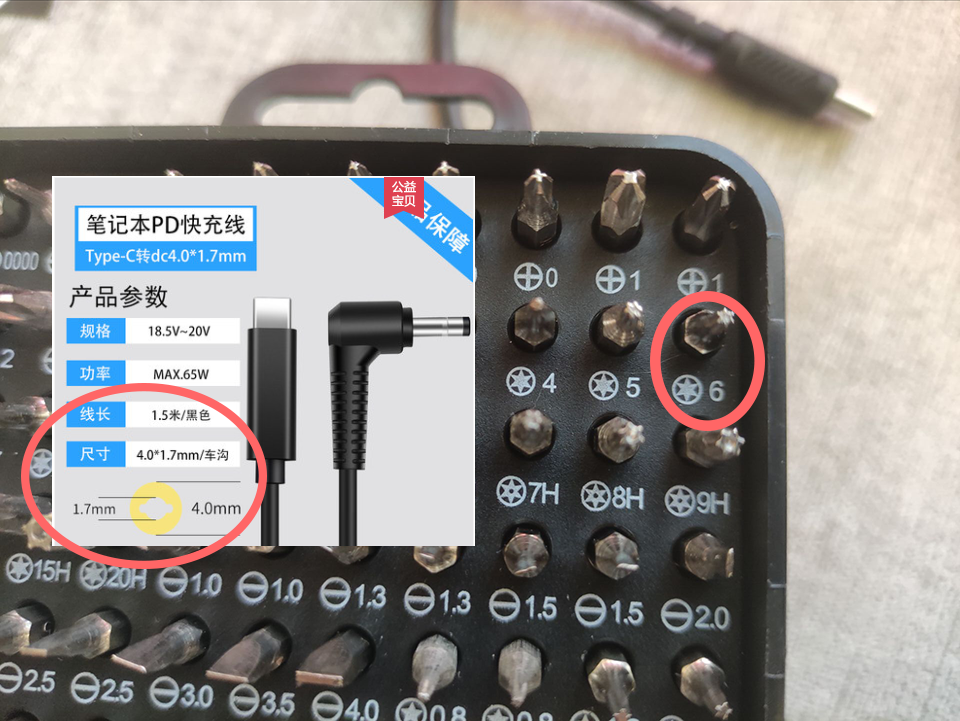

# Lenovo XiaoXin Air-14 2019IML

Screenshot app: /capXDR 
Model：Lenovo-Air14IML (made by lietxia)  
QQ group number：1032311345

[中文](./README.md)  
ENGLISH  

|      Info        |  Status  |                    Details                     |
| :--------------: | :------: | :--------------------------------------------: |
| Computer model💻 |   ✅    |         Lenovo XiaoXin Air14 IML 2019          |
|     System🌌     |   ✅    |         Catalina/Big Sur/Monterey/Ventura      |
|      CPU🎛️       |   ✅    |        Intel Core i5-10210U / i7-10510U        |
|  Motherboard🎛️   |   ✅    |               Lenovo LNVNB161216               |
|  Fingerprint🖐️   |   ⛔    |         Fingerprint is unable to work          |
|      GPU👾       |   ⛔    |         Nvidia GeForce MX250 ( 2 GB )          |
|      IGPU👾      |   ✅    |                 Intel UHD 620                  |
|     Memory💳     |   ✅    | Internal 4GB 2666 + Changeable 8GB 2666 memory |
|     Disks💽      |   ✅    |              See Benchmarks/Disks              |
|     Screen🖥️     |   ✅    |    AUO353D/LGD05EC ( 14-inches ) 1920x1080     |
|   Audio Card🔊   |   ✅    |                Conexant CX8070                 |
|    Wireless🌐    |   ✅    |  Intel Wireless-AC 9560 / Dell Wireless 1820A  |
|   Bluetooth🦷    |   ✅    |   DW1820A works, AC9560 is not that perfect    |
| SD card reader🗂️ |   ✅    |    O2 Micro （working）/ Realtek （working）  |
|    TrackPad🖐️    |   ✅    |         Works in GPIO mode with Pin=50         |
|      HDMI📺      |   ✅    |    able to output 4k@30fps, same as windows    |
|     Camera🎦     |   ✅    |      it's pretty easy to drive USB camera      |
|     Sleep😴      |   ✅    |             Support native sleep.              |

## Current Status：
* System🌌：Catalina / Big Sur / Monterey / Ventura
* Disks🖴：If you are using Samsung PM981A, please consider to change.
* Audio Card🔊：Success with layout-id 15, no plosive [Headsets_with_Microphone](https://github.com/lietxia/XiaoXinAir14IML_2019_hackintosh/releases/tag/0.0.1)

## Related models
* [XiaoXin Pro13 (i5-10210U / i7-10710U)](https://github.com/daliansky/XiaoXinPro-13-hackintosh)
* [XiaoXin13 IML](https://github.com/sun19970908/XiaoXin13IML_2020_hackintosh)
* [XiaoXin Air13 IWL (i5-8265U / i7-8565U)](https://github.com/daliansky/Lenovo-Air13-IWL-Hackintosh)
* [XiaoXin Air15 IKBR (i5-8265U)](https://github.com/czy1024/XiaoXin-Air15-IKBR-2018-EFI)
* [XiaoXin Air14 (i5-1035G1)](http://bbs.pcbeta.com/viewthread-1873103-1-1.html)
* [XiaoXin Air14 (i7-1065G7)](http://bbs.pcbeta.com/viewthread-1878378-1-1.html)
* [XiaoXin Air15 (i5-1035G1)](http://bbs.pcbeta.com/viewthread-1874022-1-1.html)
* [XiaoXin Air15 (i5-10210U)](http://bbs.pcbeta.com/viewthread-1859586-1-1.html)
* [Lenovo-Ideapad-S540-15IML (i5-10210U)](https://github.com/3ig/IdeaPad-S540-15IML-hackintosh)
* [Lenovo-Ideapad-S540-15IML (i5-10210U)](https://github.com/ayush5harma/IdeaPad-S540-Hackintosh)
* [Lenovo-Ideapad-S540-15IWL (i5-8265U)](https://github.com/IvanAleksandrov94/Lenovo-s340-s540-Big-Sur-OpenCore-i5-8265u)
* [Lenovo-Ideapad-S540-14IML (i5-10210U)](https://github.com/marianopela/Lenovo-Ideapad-S540-14IML-Hackintosh)
* [Lenovo-Ideapad-S540-14IWL (i5-8265U)](https://github.com/Hasodikis/Lenovo-Ideapad-s540-14IWL---Hackintosh)
* [Lenovo-Ideapad-S540-14IML (i5-10210U / i7-10510U)](https://github.com/mandresve/Lenovo-IdeaPad-S540-Hackintosh)

## BIOS 
https://newsupport.lenovo.com.cn/driveDownloads_detail.html?driveId=78312

Details

2022/05/13 BIOS Version: CKCN19WW http://newdriverdl.lenovo.com.cn/newlenovo/alldriversupload/94976/BIOS-CKCN19WW.exe  
2022/03/18 BIOS Version: CKCN18WW http://newdriverdl.lenovo.com.cn/newlenovo/alldriversupload/92231/BIOS-CKCN18WW.exe  
2021/07/23 BIOS Version: CKEC17WW http://newdriverdl.lenovo.com.cn/newlenovo/alldriversupload/83713/BIOS-CKCN17WW.exe  
2021/01/18 BIOS Version: CKCN16WW http://newdriverdl.lenovo.com.cn/newlenovo/alldriversupload/78312/BIOS-CKCN16WW.exe  
2020/07/24 BIOS Version: CKCN15WW http://newdriverdl.lenovo.com.cn/newlenovo/alldriversupload/73409/BIOS-CKCN15WW.exe  
2020/06/22 BIOS Version: CKCN14WW http://newdriverdl.lenovo.com.cn/newlenovo/alldriversupload/72386/BIOS-CKCN14WW.exe  
2019/12/16 BIOS Version: CKCN12WW http://newdriverdl.lenovo.com.cn/newlenovo/alldriversupload/67169/BIOS-CKCN12WW.exe  
2019/08/08 BIOS Version: CKCN11WW http://newdriverdl.lenovo.com.cn/newlenovo/alldriversupload/60449/BIOS-CKCN11WW.exe  

## Microcode
https://newsupport.lenovo.com.cn/driveDownloads_detail.html?driveId=77695

Details

2021/07/23 Version: CKME05WW http://newdriverdl.lenovo.com.cn/newlenovo/alldriversupload/83714/FW-CKME05WW.exe  
2020/12/17 Version: CKME03WW http://newdriverdl.lenovo.com.cn/newlenovo/alldriversupload/77695/FW-CKME03WW.exe  
2020/06/23 Version: CKME02WW http://newdriverdl.lenovo.com.cn/newlenovo/alldriversupload/72429/ME-CKME02WW.exe  
2019/12/16 Version: CKME01WW http://newdriverdl.lenovo.com.cn/newlenovo/alldriversupload/67174/FW-CKME01WW.exe  

## Changelog
* 2023-08-07 23:05
    * Support macOS Somoma.

* See [changelog-en.md](changelog-en.md) for the history of changes

## [Installation (For U-Disks larger than 4GB)](https://www.bilibili.com/video/BV1C64y1q7r1/)
1. If you are using OpenCore, Please use BIOS except for 1.0.2  (1.0.2 you need to turn off the Hyper-Threading to use OC.)
2. Change BIOS settings
      * https://github.com/lietxia/XiaoXinAir14IML_2019_hackintosh/wiki/bios
3. Change DVMT and CFG Lock.
4. Download [balenaEtcher](https://www.balena.io/etcher/), use it to flash [2022-06-19-XiaoXinAir14IML-4in1-installerV7.dmg](https://pan.baidu.com/s/1cYWvpfH9B0i6_Y0BnfAA0w?pwd=q27r)(Password：q27r)  
5. Boot the Second EFI partition and choose the system you want to install.

### macOS12 recovery+EFI (format your u-disk with FAT32, then unzip this package)(suitable for 1G/2G U-disk)
* [Baidu Netdisk](https://pan.baidu.com/s/10RP9a_UNlNt1Y4ul_62Mpw?pwd=ggtj ) (Password: ggtj) 
* [Tianyi Netdisk](https://cloud.189.cn/web/share?code=QvayQb2UBbMv) (Password: 0ufg) 
* [123 Netdisk](https://www.123pan.com/s/IvKKVv-jqeHh)

## Advice
* [Prevent intermittent hackintosh disconnections Thanks @Unstoppablesss] Modify System Preferences/Eneragy Saver/Power Adapter/Put hard disk to sleep when possible(modify to off)  
* Because current hibernate cannot wake up normally, in order to avoid affecting sleep, use  the terminal to turn off hibernate `sudo pmset -a hibernatemode 0` 

### VoltageShift `Highly dangerous`
* Advantage：Undervolt the CPU to gain more efficiency and make the machine cooler
* Method：
    * 1.Follow BIOS_UnlockOCPM‘s readme to unlock `Overclocking Performance Menu` `Extremely dangerous, please backup your BIOS`
    * 2.Switch `Advanced` → `Overclocking Performance Menu` → `Overclocking Feature` → `Enabled`
    * 3.Undervolt in macOS with VoltageShift

### YogaSMC： `Experimental`
* Normal: Fan three modes switch, microphone mute, flight mode, F10 switch screen, touchpad switch hint, keyboard backlight, Fn function key switch.
* Abnormal: the camera has a hint, but it can't be turned off, the lock function can't be used, FN + Q can't work, the keyboard backlight will be displayed incorrectly when the power is plugged in, the battery temperature can't be read out, and you can't switch the charging speed in the system.

### Synchronize bluetooth link keys from macOS to windows
https://github.com/lietxia/BT-LinkkeySync

### Hi-DPI (Big Sur and upper)

    bash -c "$(curl -fsSL https://raw.githubusercontent.com/xzhih/one-key-hidpi/dev/hidpi.sh)"

### Catalina Hi-DPI

    bash -c "$(curl -fsSL https://raw.githubusercontent.com/xzhih/one-key-hidpi/master/hidpi.sh)"
    
### DW1820A Windows 10 driver
https://www.dell.com/support/home/zh-cn/drivers/driversdetails?driverid=98wfd

### Change DVMT and CFG Lock
> You must unlock `CFG Lock` , otherwise, you can't use both OpenCore and Clover.  
> We recommend to change `DVMT` into 64M, there's no damage to your computer. 

* Recommend: get into hidden BIOS   
  - The way to enter hidden BIOS
    - Switch off the `OneKeyBattery`
    - Press following buttons with your computer closed.
       - `F4` → `4` → `R` → `F` → `V`
       - `F5` → `5` → `T` → `G` → `B`
       - `F6` → `6` → `Y` → `H` → `N`
       - Power on → Press F2, speed up if failed.
 - Change the following settings.
     - `Advanced` → `Power & Performance` → `CPU - Power Management Control` → `CPU Lock Configuration` → `CFG Lock` → `Disabled`
     - `Advanced` → `System Agent (SA) Configuration` → `Graphics Configuration` → `DVMT Pre-Allocated` → `64M`

* Backup solution: change in Windows
  * Refer to https://github.com/lietxia/XiaoXinAir14IML_2019_hackintosh/wiki/DVMT  
  * `DVMT`：  
     * Area : `SaSetup`
     * Offset : `0x107`
     * `01` to `02`

  * `CFG LOCK`：  
     * Area : `CpuSetup`  
     * Offset : `0x3E`  
     * `01` to `00`

### The audio card isn't working.
Switching from win to mac will cause the audio card fail to syart. At this time, you need to turn it off and turn it on again, and the audio card will recover  
Consultation got the answer: win restart is warm boot, will skip hardware detection, directly restart into mac will have problems  

* Suggestion: switch from win to mac, do not restart, shut down first, and then turn on
* Restart from mac won't cause this.

### How to make it better?
* PrintScreen can't be used under mac. I map it to F13 and you can change the shortcut key of screenshot to F13
* Turn on HiDPI (see HiDPI part)

## SSDT
| SSDTs              | Info                                   | Necessary | Recommended | Optional |
| ------------------ | -------------------------------------- | --------- | ----------- | -------- |
| SSDT-SBUS-MCHC     | Fake BUS0, DVL0, MCHC device           |           | √           |          |
| SSDT-EC-USBX       | Fake EC device, USB Power Patch        | √         |             |          |
| SSDT-TPAD-Air14IML | I2C Trachpad patch (AIR14IML only)     | √         |             |          |
| SSDT-DMAC          | Fake DMA controller                    |           |             | √        |
| SSDT-GPRW          | Anti immediate wakeup: 0D/6D           | √         |             |          |
| SSDT-PMC           | Fake PMC device                        |           | √           |          |
| SSDT-HPTE          | Disable HPET patch                     |           |             | √        |
| SSDT-PNLFCFL       | Coffee Lake PNLF patch                 | √         |             |          |
| SSDT-PR00          | X86 CPU Power Management (Enable XCPM) | √         |             |          |
| SSDT-RMCF-Air14IML | PS2 key mapping patch                  | √         |             |          |
| SSDT-UIAC          | Custom USB                             |           | √           |          |
| SSDT-BATX-Air14IML | Battery extra info                     |           |             | √        |
| SSDT-AWAC          | “Fake” RTC timer                       |           | √           |          |
| SSDT-ECRW          | YogaSMC EC accessibility               |           |             | √        |

## Notes
* You need a T6 screwdriver to disassemble the machine. After the screws are removed, use the unused card and carefully disassemble it from the other side of the screen https://www.bilibili.com/video/BV1X341157kf/  
* If you want to buy a type-c cable, you should buy one with 4mm diameter, and the hole diameter is 1.7mm  

## Credits
- [Acidanthera](https://github.com/acidanthera) for [OpenCore](https://github.com/acidanthera/OpenCorePkg) and [other kexts](https://github.com/acidanthera).
- [Apple](https://www.apple.com) for [macOS](https://www.apple.com/macos).
- [lietxia](https://github.com/lietxia) for the whole EFI.
- [zxystd](https://github.com/zxystd) for developing [itlwm](https://github.com/OpenIntelWireless/itlwm).
- [Bat.bat](https://github.com/williambj1) for developing [IntelBluetoothFirmware](https://github.com/OpenIntelWireless/IntelBluetoothFirmware) and [HeliPort](https://github.com/OpenIntelWireless/HeliPort).
- [alexandred](https://github.com/alexandred) for developing [VoodooI2C](https://github.com/VoodooI2C/VoodooI2C).
- [athlonreg](https://github.com/athlonreg/) for developing [ALCPlugFix](https://github.com/athlonreg/AppleALC-ALCPlugFix) to fix microphone switch issue.
- [win1010525](https://github.com/win1010525) for translating English readme and add AIO version EFI.
- [sun19970908](https://github.com/sun19970908) for providing codec, modify ALCPlugFix and test CPUFriend.
- [stevezhengshiqi](https://github.com/stevezhengshiqi) for [one-key-cpufriend](https://github.com/stevezhengshiqi/one-key-cpufriend)
- [SoMeone](https://user.qzone.qq.com/504674749/infocenter) for modifying BIOS
- [mandresve](https://about.me/mandresve) for O2 Card Reader Support & Voltageshift underclock enable and testing.
