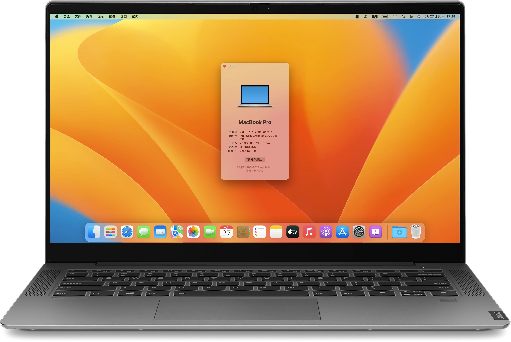
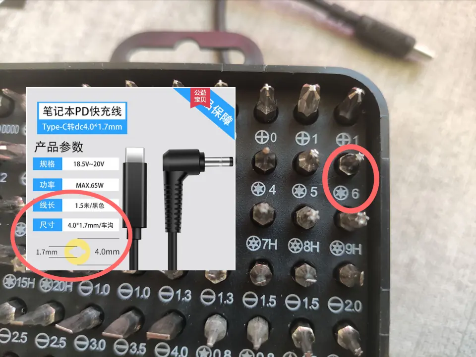

# 联想小新 Air-14 2019IML

截图软件：[capXDR](https://github.com/lihaoyun6/capXDR-plugins)  
模板：Lenovo-Air14IML
QQ群号：1032311345

中文  
[ENGLISH](./README-en.md)

|  规格   | 状态 |                       详细信息                       |
| :-----: | ---- | :--------------------------------------------------: |
|  型号💻  | ✅    |            Lenovo XiaoXin Air14 IML 2019             |
|  系统🌌  | ✅    |          Catalina/Big Sur/Monterey/Ventura/Sonoma     |
|  CPU🎛️   | ✅    |           Intel Core i5-10210U / i7-10510U           |
|  主板🎛️  | ✅    |                  Lenovo LNVNB161216                  |
|  指纹🖐️  | ⛔    |                     指纹无法工作                     |
|  GPU👾   | ⛔    |              Nvidia GeForce MX250(屏蔽)              |
|  iGPU👾  | ✅    |                    Intel UHD 620                     |
|  内存💳  | ✅    |            内置4GB+可更换的32GB DDR4 2666             |
|  硬盘💽  | ✅    |                 见 Benchmarks/Disks                  |
|  屏幕🖥️  | ✅    |    AUO353D/LGD05EC（14英寸） 1920x1080 60~75Hz(超频)    |
|  声卡🔊  | ✅    |                   Conexant CX8070                    |
|  wifi🌐  | ✅    |            Intel Wireless-AC 9560/DW1820A            |
|  蓝牙🦷  | ✅    |            Intel Wireless-AC 9560/DW1820A            |
| 读卡器🗂️ | ✅    |            O2 Micro 读卡器 / Realtek 读卡器             |
| 触摸板🖐️ | ✅    |                 已运行在GPIO中断 Pin=50                 |
|  HDMI📺  | ✅    |               可输出4k30帧,和win表现一致              |
| 摄像头🎦 | ✅    |                 USB摄像头还是很好驱动的                |
|  睡眠😴  | ✅    |                      支持原生睡眠                     |

## 目前状态：
* 系统🌌：Catalina / BigSur / Monterey / Ventura / Sonoma （Sequoia暂无适配计划）
* 硬盘：如果你硬盘是三星PM981A，建议换掉。
* 声卡🔊：仿冒layout-id 15成功 [耳麦一体耳机需要这个](https://github.com/lietxia/XiaoXinAir14IML_2019_hackintosh/releases/tag/0.0.1) 

## 相关机型
* [小新Pro13（i5-10210U / i7-10710U）](https://github.com/daliansky/XiaoXinPro-13-hackintosh)
* [小新13IML](https://github.com/sun19970908/XiaoXin13IML_2020_hackintosh)
* [小新air13IWL（i5-8265U / i7-8565U）](https://github.com/daliansky/Lenovo-Air13-IWL-Hackintosh)
* [小新air15IKBR（i5-8265U）](https://github.com/czy1024/XiaoXin-Air15-IKBR-2018-EFI)
* [小新air14（i5-1035G1）](http://bbs.pcbeta.com/viewthread-1873103-1-1.html)
* [小新air14（i7-1065G7）](http://bbs.pcbeta.com/viewthread-1878378-1-1.html)
* [小新air15（i5-1035G1）](http://bbs.pcbeta.com/viewthread-1874022-1-1.html)
* [小新air15（i5-10210U）](http://bbs.pcbeta.com/viewthread-1859586-1-1.html)
* [Lenovo-Ideapad-S540-15IML（i5-10210U）](https://github.com/3ig/IdeaPad-S540-15IML-hackintosh)
* [Lenovo-Ideapad-S540-15IML（i5-10210U）](https://github.com/ayush5harma/IdeaPad-S540-Hackintosh)
* [Lenovo-Ideapad-S540-15IWL（i5-8265U）](https://github.com/IvanAleksandrov94/Lenovo-s340-s540-Big-Sur-OpenCore-i5-8265u)
* [Lenovo-Ideapad-S540-14IML（i5-10210U）](https://github.com/marianopela/Lenovo-Ideapad-S540-14IML-Hackintosh)
* [Lenovo-Ideapad-S540-14IWL（i5-8265U）](https://github.com/Hasodikis/Lenovo-Ideapad-s540-14IWL---Hackintosh)
* [Lenovo-Ideapad-S540-14IML (i5-10210U / i7-10510U)](https://github.com/mandresve/Lenovo-IdeaPad-S540-Hackintosh)

## BIOS 
https://newsupport.lenovo.com.cn/driveDownloads_detail.html?driveId=78312

展开查看

2022/05/13 BIOS Version: CKCN19WW http://newdriverdl.lenovo.com.cn/newlenovo/alldriversupload/94976/BIOS-CKCN19WW.exe  
2022/03/18 BIOS Version: CKCN18WW http://newdriverdl.lenovo.com.cn/newlenovo/alldriversupload/92231/BIOS-CKCN18WW.exe  
2021/07/23 BIOS Version: CKCN17WW http://newdriverdl.lenovo.com.cn/newlenovo/alldriversupload/83713/BIOS-CKCN17WW.exe  
2021/01/18 BIOS Version: CKCN16WW http://newdriverdl.lenovo.com.cn/newlenovo/alldriversupload/78312/BIOS-CKCN16WW.exe  
2020/07/24 BIOS Version: CKCN15WW http://newdriverdl.lenovo.com.cn/newlenovo/alldriversupload/73409/BIOS-CKCN15WW.exe  
2020/06/22 BIOS Version: CKCN14WW http://newdriverdl.lenovo.com.cn/newlenovo/alldriversupload/72386/BIOS-CKCN14WW.exe  
2019/12/16 BIOS Version: CKCN12WW http://newdriverdl.lenovo.com.cn/newlenovo/alldriversupload/67169/BIOS-CKCN12WW.exe  
2019/08/08 BIOS Version: CKCN11WW http://newdriverdl.lenovo.com.cn/newlenovo/alldriversupload/60449/BIOS-CKCN11WW.exe  

## 微码
https://newsupport.lenovo.com.cn/driveDownloads_detail.html?driveId=77695

展开查看

2021/07/23 Version: CKME05WW http://newdriverdl.lenovo.com.cn/newlenovo/alldriversupload/83714/FW-CKME05WW.exe  
2020/12/17 Version: CKME03WW http://newdriverdl.lenovo.com.cn/newlenovo/alldriversupload/77695/FW-CKME03WW.exe  
2020/06/23 Version: CKME02WW http://newdriverdl.lenovo.com.cn/newlenovo/alldriversupload/72429/ME-CKME02WW.exe  
2019/12/16 Version: CKME01WW http://newdriverdl.lenovo.com.cn/newlenovo/alldriversupload/67174/FW-CKME01WW.exe  

## 更新小记
* 2024-05-26 10:30
    * 支持macOS Somoma 14.4+
    * 更新Opencore和Kexts.

* 历史修改记录见[changelog.md](changelog.md)

## [安装方法（适用于4G以上U盘）](https://www.bilibili.com/video/BV1C64y1q7r1/)
1. 如果你使用openCore，BIOS请使用1.0.2之外的版本 （1.0.2需要关掉超线程才能使用oc）
2. 改BIOS设置（推荐和必须的地方必须改） https://github.com/lietxia/XiaoXinAir14IML_2019_hackintosh/wiki/bios
3. 改DVMT和 CFG Lock（见后文，推荐做）
4. 下载[balenaEtcher](https://www.balena.io/etcher/)，用它写入:[2022-06-19-XiaoXinAir14IML-4in1-installerV7.dmg](https://pan.baidu.com/s/1cYWvpfH9B0i6_Y0BnfAA0w?pwd=q27r)(提取码：q27r)
5. 引导写入的镜像的第二个EFI分区，选择需要安装的系统即可。

## 建议  
* 【防止黑苹果间歇性断网-解决方案 感谢@Unstoppablesss】修改 系统偏好设置/节能/电源适配器/如果可能，使硬盘进入睡眠（修改为off）
* 因目前休眠无法正常唤醒 , 为避免影响到睡眠 , 终端使用命令关闭休眠 `sudo pmset -a hibernatemode 0`

### VoltageShift `高度危险`
* 用途：降压获得更高能效，可以显著降低温度或提升一定功耗下的性能（约50%）
* 方法：
    * 1.遵循BIOS_UnlockOCPM的指示解开超频菜单 `极度危险，务必备份BIOS`
    * 2.打开 `Advanced` → `Overclocking Performance Menu` → `Overclocking Feature` → `Enabled`
    * 3.在macOS中使用VoltageShift进行修改

### YogaSMC `实验性支持`
* 正常的：风扇三种模式切换、麦克风静音、飞行模式、F10切换屏幕、触摸板开关有提示、键盘背光、Fn功能键切换
* 不正常：摄像头有提示，但是关不掉、锁定功能用不了、Fn+Q不能修改、拔插电源会错误显示键盘背光、电池温度读不出来、不能调整充电速度 

### macOS蓝牙与windows10同步
https://github.com/lietxia/BT-LinkkeySync

### Big Sur 及以上开启hidpi（高分辨率，较卡）

    bash -c "$(curl -fsSL https://raw.githubusercontent.com/xzhih/one-key-hidpi/dev/hidpi.sh)"

### Catalina 开启hidpi（高分辨率）

    bash -c "$(curl -fsSL https://raw.githubusercontent.com/xzhih/one-key-hidpi/master/hidpi.sh)"
    
### DW1820A WINDOWS10驱动(DRIVER)
https://www.dell.com/support/home/zh-cn/drivers/driversdetails?driverid=98wfd

### 改DVMT和 CFG Lock
> 必须解锁 `CFG Lock` 不然无法使用Opencore   
> 建议解锁 `DVMT` 让显存大小变成64M，没有什么坏处。 

* 推荐方法: 进隐藏BIOS  
  - BIOS里的 `onekeybattery` 需要关闭，才能进隐藏BIOS  
  - 隐藏BIOS进入姿势
     - 电源键开机 → F2进入正常BIOS → 电源键关机 → 然后顺序按下下列键
     - `F4` → `4` → `R` → `F` → `V`
     - `F5` → `5` → `T` → `G` → `B`
     - `F6` → `6` → `Y` → `H` → `N`
     - 电源键开机 → F2进入隐藏BIOS , 如不成功请加快手速再次尝试
  - 推荐设置选项
     - `Advanced` → `Power & Performance` → `CPU - Power Management Control` → `CPU Lock Configuration` → `CFG Lock` → `Disabled`
     - `Advanced` → `System Agent (SA) Configuration` → `Graphics Configuration` → `DVMT Pre-Allocated` → `64M`

* 备用方法: windows直接改  
  - 参考 https://github.com/lietxia/XiaoXinAir14IML_2019_hackintosh/wiki/DVMT  
  - `DVMT`：  
     * 区域（area） : `SaSetup`
     * 偏移（offset） : `0x107`
     * `01` to `02`

  - `CFG LOCK`：  
     * 区域（area） : `CpuSetup`
     * 偏移（offset） : `0x3E`
     * `01` to `00`

### MacForge 
* 用途：增加M系列独占的高级地图功能
* 方法：运行/macforge/install.command
    
### 如何更爽一点?
* 截图键(PrintScreen PrtSC)在mac下是不能用的,我把他映射到F13,自己把截图快捷键改到F13即可(系统偏好设置-键盘-快捷键-截屏)

## 热补丁
| 补丁               | 说明                           | 必备 | 建议 | 可选 |
| ------------------ | ------------------------------ | ---- | ---- | ---- |
| SSDT-SBUS-MCHC.aml | SBUS + MCHC                    |      | √    |      |
| SSDT-EC-USBX.aml   | EC+USBX                        | √    |      |      |
| SSDT-TPAD-Air14IML | I2C触摸板补丁(AIR14IML专用)    | √    |      |      |
| SSDT-DMAC          | 仿冒 DMA 控制器                |      |      | √    |
| SSDT-GPRW          | 防秒醒:0D / 6D 睡了即醒补丁    | √    |      |      |
| SSDT-PMC           | PMC 设备                       |      | √    |      |
| SSDT-HPTE          | 屏蔽 HPET 补丁                 |      |      | √    |
| SSDT-PNLFCFL       | Coffee Lake 亮度控制补丁       | √    |      |      |
| SSDT-PR00          | (X86)CPU电源管理补丁(开启XCPM) | √    |      |      |
| SSDT-RMCF-Air14IML | PS2 按键映射补丁               | √    |      |      |
| SSDT-UIAC          | 定制USB                        |      | √    |      |
| SSDT-BATX-Air14IML | 电池附加信息                   |      |      | √    |
| SSDT-AWAC          | “伪” RTC时钟                   |      | √    |      |
| SSDT-ECRW          | yogaSMC的EC访问补丁            |      |      | √    |

## 备注
* 拆机需要6号的6角螺丝刀。螺丝拿下来之后，用不用的银行卡，慢慢从屏幕那一侧慢慢拆开 https://www.bilibili.com/video/BV1X341157kf/  
* 如果要买【圆口转USB type转接器】，注意【圆口直径4毫米，孔直径1.7毫米】  

## 鸣谢
- [Acidanthera](https://github.com/acidanthera) 开发的 [OpenCore](https://github.com/acidanthera/OpenCorePkg) 和 [其他驱动](https://github.com/acidanthera)
- [Apple](https://www.apple.com) 开发的 [macOS](https://www.apple.com/macos)
- [lietxia](https://github.com/lietxia) 维护EFI
- [zxystd](https://github.com/zxystd) 开发的 [itlwm](https://github.com/OpenIntelWireless/itlwm)
- [Bat.bat](https://github.com/williambj1) 开发的 [IntelBluetoothFirmware](https://github.com/OpenIntelWireless/IntelBluetoothFirmware) 和 [HeliPort](https://github.com/OpenIntelWireless/HeliPort)
- [alexandred](https://github.com/alexandred) 开发的 [VoodooI2C](https://github.com/VoodooI2C/VoodooI2C)
- [athlonreg](https://github.com/athlonreg/) 开发的 [ALCPlugFix](https://github.com/athlonreg/AppleALC-ALCPlugFix) 来修复耳麦一体耳机的问题
- [Celestial紗雪](https://github.com/CelestialSayuki) 翻译英文readme并制作AIO版本EFI
- [sun19970908](https://github.com/sun19970908) 提供ALC节点，修改ALCPlugFix并测试CPUFriend
- [stevezhengshiqi](https://github.com/stevezhengshiqi) 开发的 [one-key-cpufriend](https://github.com/stevezhengshiqi/one-key-cpufriend)
- [SoMeone](https://user.qzone.qq.com/504674749/infocenter) 破解的隐藏 BIOS
- [mandresve](https://about.me/mandresve) 对O2读卡器的支持和Voltageshift超频的启用和测试。
- [PoomSmart](https://github.com/PoomSmart) 开发的 [AdvancedMapEnabler](https://github.com/PoomSmart/AdvancedMapEnabler)
- [MacEnhance](https://github.com/MacEnhance/) 开发的 [MacForge](https://github.com/MacEnhance/MacForge)
